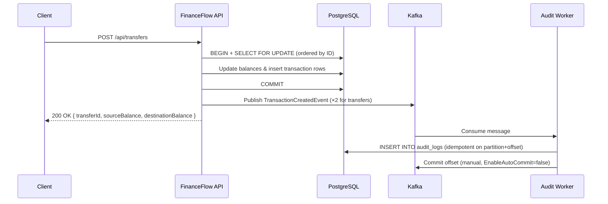

 # FinanceFlow

[](https://github.com/giovannimedici/FinanceFlow/actions/workflows/ci.yml)

Event-driven banking transaction processor built with .NET 8, Apache Kafka, and PostgreSQL. Demonstrates atomic money transfers, asynchronous audit logging, and a clean layered architecture suitable for technical interviews and portfolio reviews.

---

## Table of Contents

- [Overview](#overview)
- [Architecture](#architecture)
- [Tech Stack](#tech-stack)
- [Quick Start](#quick-start)
- [Project Structure](#project-structure)
- [Design Decisions](#design-decisions)
- [How to Test](#how-to-test)
- [Known Limitations](#known-limitations)

---

## Overview

**FinanceFlow** is a simplified core-banking API that manages accounts and financial transactions (deposits, withdrawals, and peer-to-peer transfers).

**Why it exists:** Financial systems must guarantee consistency under concurrency — two simultaneous transfers touching the same account cannot corrupt balances — while keeping cross-cutting concerns like audit logging decoupled from the write path. This project showcases that trade-off in a runnable, testable codebase. It is not a production bank, but a deliberate reference implementation of event-driven transaction processing.

**Core capabilities:**

- Create and manage bank accounts with lifecycle states (Active / Blocked / Closed)
- Deposit, withdraw, and transfer funds with rich domain-level validation
- Atomic transfers using PostgreSQL row-level locking (`SELECT … FOR UPDATE`)
- Publish `TransactionCreatedEvent` to Kafka after every successful DB commit
- Consume events asynchronously in a dedicated Audit Worker that persists an immutable audit trail

---

## Architecture

### Event flow: API → Kafka → Consumer

```
┌────────────┐     HTTP      ┌───────────────────┐
│   Client   │──────────────▶│  FinanceFlow API  │
└────────────┘               │  (Minimal APIs)   │
                             └─────────┬─────────┘
                                       │
                          1. DB transaction (commit)
                          2. Publish event (best-effort)
                                       │
                   ┌───────────────────┼───────────────────┐
                   ▼                                       ▼
        ┌──────────────────┐                 ┌────────────────────┐
        │  PostgreSQL 16   │                 │   Apache Kafka     │
        │  ─────────────── │                 │   ─────────────    │
        │  accounts        │◀────────────────│   finance.         │
        │  transactions    │  3. Persist     │   transactions.    │
        │  audit_logs      │     audit log   │   created          │
        └──────────────────┘                 └────────┬───────────┘
                                                      │ subscribe
                                             ┌────────▼───────────┐
                                             │   Audit Worker     │
                                             │   (BackgroundSvc)  │
                                             └────────────────────┘
```

### Sequence diagram



**Topic:** `finance.transactions.created`  
**Partition key:** `AccountId` — preserves per-account ordering  
**Consumer group:** `audit-consumer-group`

---

## Tech Stack

| Component | Technology | Version |
|-----------|------------|---------|
| Runtime | .NET | **8.0** |
| Language | C# | **12** |
| API style | ASP.NET Core Minimal APIs | 8.0 |
| Messaging broker | Apache Kafka (Confluent Platform) | **7.6.0** |
| Kafka client | Confluent.Kafka | **2.6.0** |
| Database | PostgreSQL | **16** (Alpine) |
| ORM | Entity Framework Core | **8.0.28** |
| DB provider | Npgsql.EntityFrameworkCore.PostgreSQL | **8.0.11** |
| Naming conventions | EFCore.NamingConventions | **8.0.3** |
| Validation | FluentValidation | **12.1.1** |
| Logging | Serilog (JSON to console) | **10.x** |
| API docs | Swashbuckle / Swagger UI | **6.6.2** |
| Health checks | AspNetCore.HealthChecks.NpgSql + Kafka | **9.0.0** |
| Test framework | xUnit + Moq + FluentAssertions | — |
| Containers | Docker + Docker Compose v2 | — |

---

## Quick Start

Get the full stack running in **under 5 minutes**.

### Prerequisites

| Tool | Minimum version |
|------|----------------|
| Docker | 24+ |
| Docker Compose | v2 (included with Docker Desktop) |
| `curl` + `jq` | any (for smoke tests) |

> No .NET SDK needed to run — everything builds inside Docker.

### 1 — Clone

```bash
git clone https://github.com/giovannimedici/FinanceFlow.git
cd FinanceFlow
```

### 2 — Configure environment

```bash
cp .env.example .env
```

The defaults work out of the box for local Docker Compose. Open `.env` only if you need to change ports or credentials.

### 3 — Start all services

```bash
docker compose up -d --build
```

This spins up: **PostgreSQL 16**, **ZooKeeper**, **Kafka**, **FinanceFlow API** (port `5001`), and **Audit Worker**.

Wait until every service is healthy (~30–60 s on the first build):

```bash
docker compose ps
```

### 4 — Verify the stack is up

```bash
curl -s http://localhost:5001/health | jq .status
# → "Healthy"
```

### 5 — Your first request

```bash
curl -s -X POST http://localhost:5001/api/accounts \
  -H "Content-Type: application/json" \
  -d '{"ownerName":"Jane Doe","documentNumber":"12345678901"}' | jq
```

**Swagger UI** (available in Development): [http://localhost:5001/swagger](http://localhost:5001/swagger)

### Stop

```bash
docker compose down          # keep PostgreSQL volume
docker compose down -v       # also wipe data
```

---

## Project Structure

```
FinanceFlow/
├── src/
│   ├── FinanceFlow.Domain/           # Entities, enums, domain exceptions — zero dependencies
│   ├── FinanceFlow.Application/      # Use cases, DTOs, validators, event contracts, ports
│   ├── FinanceFlow.Infrastructure/   # EF Core, repositories, Kafka publisher/initializer, migrations
│   ├── FinanceFlow.API/              # HTTP endpoints, middleware, Swagger, health checks
│   └── FinanceFlow.Workers.Audit/    # Kafka BackgroundService consumer → audit_logs table
├── tests/
│   └── FinanceFlow.Tests/            # Unit & integration tests (≥70 % line coverage on Domain + Application)
├── docker-compose.yml
├── .env.example
└── FinanceFlow.sln
```

### Layer responsibilities

| Layer | Responsibility |
|-------|---------------|
| **Domain** | Rich entities (`Account`, `Transaction`), business invariants, and `DomainException` |
| **Application** | Orchestration services (`TransferService`, `TransactionService`), interface ports (`IEventPublisher`, `IAccountRepository`, `IUnitOfWork`), Kafka event schema (`TransactionCreatedEvent`) |
| **Infrastructure** | EF Core `DbContext`, repository implementations, `KafkaEventPublisher` (idempotent producer, `Acks.All`), `UnitOfWork`, DB migrations |
| **API** | Thin HTTP adapters — FluentValidation wiring, endpoint mapping, `ExceptionHandlingMiddleware`, no business logic |
| **Workers.Audit** | Independent process: subscribes to `finance.transactions.created`, stores deduplicated audit records (idempotent on `partition+offset`), manual offset commit |

Dependency direction: `API` / `Workers.Audit` → `Application` → `Domain`. `Infrastructure` implements `Application` ports.

---

## Design Decisions

### Why Kafka?

The ledger write (DB commit) and side effects (audit trail, future notifications, fraud scoring) have different reliability, latency, and scaling requirements. Coupling them in a single HTTP transaction would:

- Inflate response latency
- Create a single point of failure across unrelated concerns
- Make independent scaling impossible

Kafka provides a durable, replayable log. A new consumer group can replay the full history at any time without touching the API. Events are published **after** the DB commit, so the database remains the single source of truth for balances.

### Why atomic DB transactions?

A transfer debits one account and credits another. Without a database transaction and row-level locks, concurrent requests against overlapping accounts can cause:

- **Lost updates** — two reads see the same balance; one update overwrites the other
- **Negative balances** — concurrent withdrawals both pass the balance check, then both deduct

The implementation uses two techniques together:

1. **Sorted lock order** — account IDs are sorted before `SELECT … FOR UPDATE`, ensuring all callers acquire locks in the same order and preventing deadlocks
2. **Single DB transaction** — balance updates and transaction log rows commit or roll back atomically

### Why separate consumers?

Side effects belong in dedicated processes, not inside the API request pipeline:

| Concern | Benefit |
|---------|---------|
| **Failure isolation** | A slow or crashing Audit Worker does not block or slow transfers |
| **Independent scaling** | Scale API replicas and worker replicas separately based on their own load profiles |
| **Single responsibility** | Each consumer group handles exactly one concern; adding a "notifications" consumer requires zero changes to the API |
| **Deploy independence** | Workers can be rolled out, rolled back, or paused without redeploying the API |

---

## How to Test

Replace `{ACCOUNT_ID}`, `{SOURCE_ID}`, and `{DEST_ID}` with UUIDs returned from account-creation responses.

### Health

```bash
curl -s http://localhost:5001/health | jq
```

### Accounts

**Create an account**
```bash
curl -s -X POST http://localhost:5001/api/accounts \
  -H "Content-Type: application/json" \
  -d '{"ownerName":"Alice","documentNumber":"11111111111"}' | jq
```

**Get account by ID**
```bash
curl -s http://localhost:5001/api/accounts/{ACCOUNT_ID} | jq
```

**List all accounts (optional status filter)**
```bash
curl -s "http://localhost:5001/api/accounts?status=Active" | jq
```

**Update account status** — valid values: `Active`, `Blocked`, `Closed`
```bash
curl -s -X PATCH http://localhost:5001/api/accounts/{ACCOUNT_ID}/status \
  -H "Content-Type: application/json" \
  -d '{"status":"Blocked"}' | jq
```

### Transactions

**Deposit**
```bash
curl -s -X POST http://localhost:5001/api/accounts/{ACCOUNT_ID}/deposit \
  -H "Content-Type: application/json" \
  -d '{"amount":1000.00,"description":"Initial deposit"}' | jq
```

**Withdraw**
```bash
curl -s -X POST http://localhost:5001/api/accounts/{ACCOUNT_ID}/withdraw \
  -H "Content-Type: application/json" \
  -d '{"amount":200.00,"description":"ATM withdrawal"}' | jq
```

**Transfer between accounts**
```bash
curl -s -X POST http://localhost:5001/api/transfers \
  -H "Content-Type: application/json" \
  -d '{
    "sourceAccountId":      "{SOURCE_ID}",
    "destinationAccountId": "{DEST_ID}",
    "amount":               350.00,
    "description":          "Rent payment"
  }' | jq
```

**List transactions for an account (paginated)**
```bash
curl -s "http://localhost:5001/api/accounts/{ACCOUNT_ID}/transactions?page=1&pageSize=20" | jq
```

### Audit

After any deposit / withdraw / transfer, wait ~2 s for the Audit Worker to process the Kafka message, then:

```bash
curl -s "http://localhost:5001/api/audit/accounts/{ACCOUNT_ID}?page=1&pageSize=20" | jq
```

Optional date range filters: `&from=2026-01-01&to=2026-12-31`

### Unit & integration tests

```bash
dotnet test
```

The CI pipeline enforces ≥ 70 % line coverage on the `Domain` and `Application` layers and uploads an HTML + Markdown coverage report as a build artifact.

---

## Known Limitations

The following are **intentional scope boundaries** for a portfolio and interview project, not bugs:

| Limitation | Detail |
|------------|--------|
| **No Outbox Pattern** | Events are published to Kafka **after** the DB commit (fire-and-forget). If Kafka is unavailable at publish time, the transaction succeeds but the audit record will be missing until manual replay. A production system would use the Transactional Outbox pattern to guarantee at-least-once delivery. |
| **No Schema Registry** | Events are serialized as plain JSON. A `SchemaVersion` field is included in `TransactionCreatedEvent` to allow future evolution, but there is no Avro / Protobuf enforcement or backward-compatibility validation via Confluent Schema Registry. |
| **No authentication** | All endpoints are publicly accessible. There is no JWT, API key, or RBAC layer — deliberately out of scope to keep the focus on transaction consistency and event-driven architecture. |
